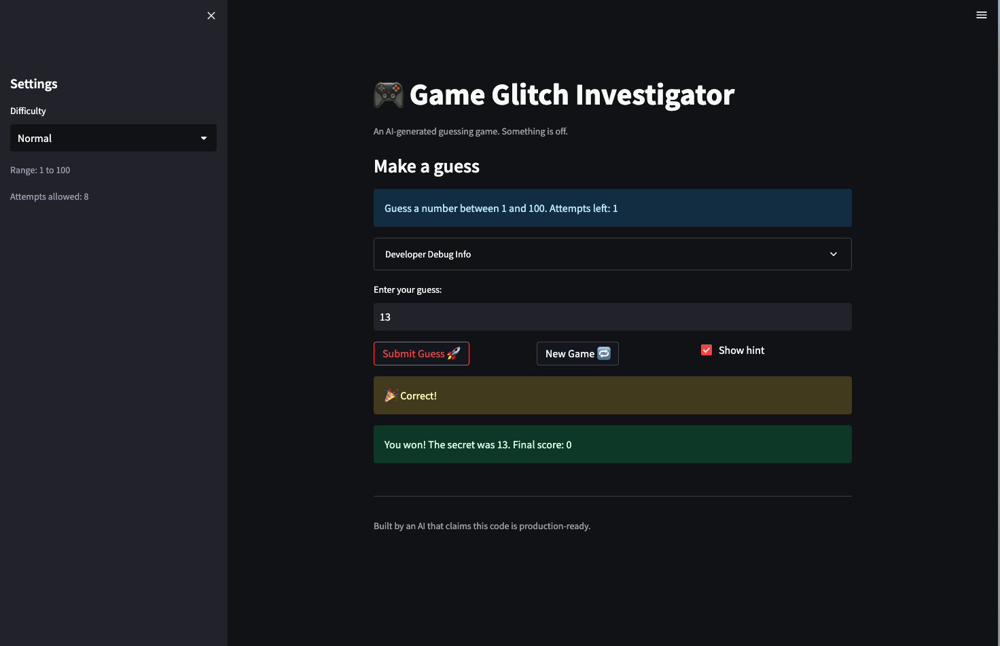

# 🎮 Game Glitch Investigator: The Impossible Guesser

## 🚨 The Situation

You asked an AI to build a simple "Number Guessing Game" using Streamlit.
It wrote the code, ran away, and now the game is unplayable.

- You can't win.
- The hints lie to you.
- The secret number seems to have commitment issues.

## 🛠️ Setup

1. Install dependencies: `pip install -r requirements.txt`
2. Run the broken app: `python -m streamlit run app.py`

## 🕵️‍♂️ Your Mission

1. **Play the game.** Open the "Developer Debug Info" tab in the app to see the secret number. Try to win.
2. **Find the State Bug.** Why does the secret number change every time you click "Submit"? Ask ChatGPT: _"How do I keep a variable from resetting in Streamlit when I click a button?"_
3. **Fix the Logic.** The hints ("Higher/Lower") are wrong. Fix them.
4. **Refactor & Test.** - Move the logic into `logic_utils.py`.
   - Run `pytest` in your terminal.
   - Keep fixing until all tests pass!

## 📝 Document Your Experience

The Impossible Guesser is a number guessing game with three difficulty levels. Easy mode uses a range of 1–20 with 6 attempts, Normal uses 1–100 with 8 attempts, and Hard uses 1–200 with 5 attempts. Each wrong guess gives a Higher/Lower hint and costs 1 point. Winning earns bonus points based on how few attempts were used.

I have found the following bugs: stagnant state switching difficulties, error pressing 'Start a New Game', guess logic

So far the fix I have refactored is the guess logic where it correctly guides the user to the direction to the guess/secret number.

## 📸 Demo Walkthrough

Describe your fixed game in numbered steps so a reader can follow along without watching a video:

1. Launch the app: python -m streamlit run app.py — the game loads on Normal difficulty (range 1–100, 7 attempts).
2. User enters a guess of 40 → game returns "📉 Go LOWER!"
3. User enters a guess of 20 → game returns "📉 Go LOWER!"
4. User enters a guess of 5 → game returns "📈 Go HIGHER!"
5. User enters a guess of 10 → game returns "📈 Go HIGHER!"
6. User enters a guess of 15 → game returns "📉 Go LOWER!"
7. User enters a guess of 13 → game returns "🎉 Correct!", confetti fires, and the final score is displayed.

**Screenshot**:

## 🧪 Test Results

======================================================== test session starts =========================================================
platform darwin -- Python 3.12.1, pytest-9.0.2, pluggy-1.6.0
rootdir: /Users/brandonlo/My Folder/[03] Learning/CodePathAI110/ai110-module1show-gameglitchinvestigator-starter
configfile: pytest.ini
plugins: anyio-4.13.0
collected 3 items

tests/test_game_logic.py ... [100%]

========================================================= 3 passed in 0.01s ==========================================================
